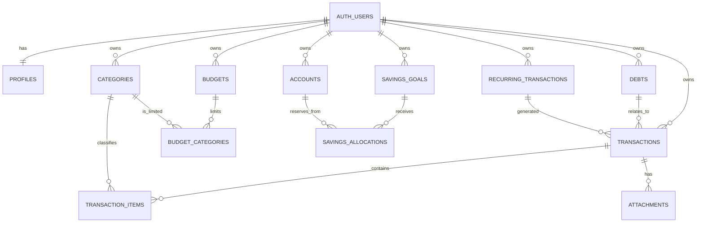

# Domain model and business rules

## ERD



## Entity ownership and cardinality

Every business table has `user_id` and is owned 1:N by `auth.users`, except `profiles` which is 1:1. A transaction has 0:N items (0 only for transfer/opening balance), 0:N attachments, and optionally one debt and recurring template. A budget may limit 0:N categories; `(budget_id, category_id)` is unique. A savings goal/account may each participate in many allocations.

## Derived formulas

```text
account_balance(account) = SUM(destination amount) - SUM(source amount)
  over non-deleted transactions

budget_category_spent = SUM(transaction_item.amount)
  for non-deleted EXPENSE transactions/items, matching category and budget date range

goal_allocated = SUM(non-deleted allocations for active goal)
available_money = SUM(active account balances) - SUM(active allocations)
debt_remaining = principal ± linked repayments (or validated materialized value)
```

The UI may cache projections for speed, but source data and server verification remain ledger-based.

## Integrity and correction rules

- Amounts are positive and at most two decimal places; use integer minor units in JavaScript/SQLite or a decimal library.
- All participating accounts/categories/debts/templates must have the same owner as the transaction.
- Transaction date cannot be implausibly invalid; future transaction policy is open.
- Server writes are atomic: transaction header plus replacing splits are one operation.
- `updated_at` changes on every mutation; `deleted_at` preserves sync tombstones.
- Conflict baseline: a finance write conflicts if remote `updated_at` is newer than local base revision. Do not silently overwrite; present a resolution unless the change is a server-validated idempotent replay.

